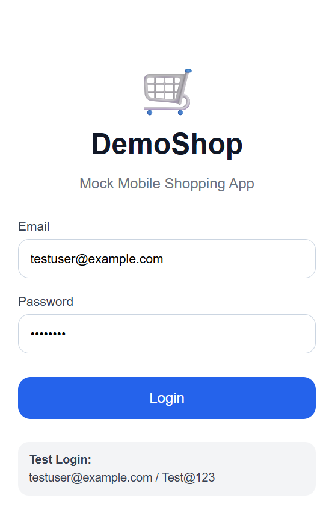
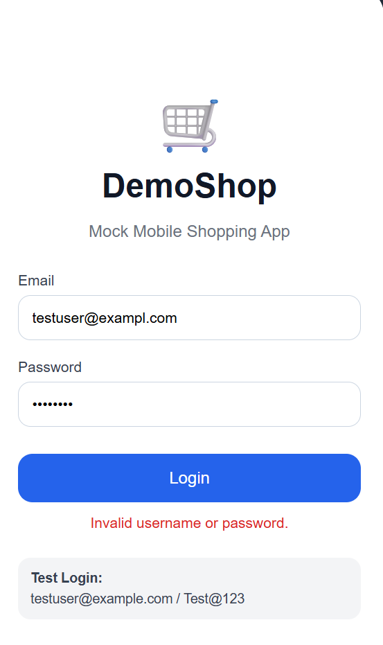
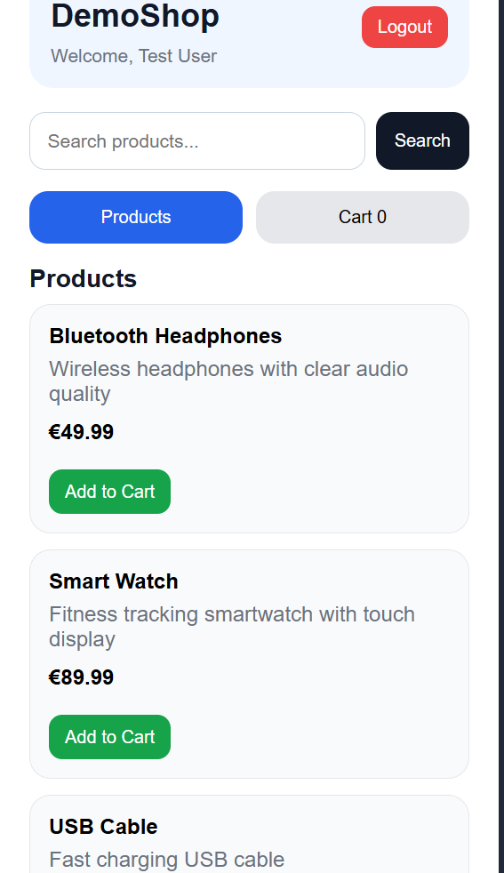
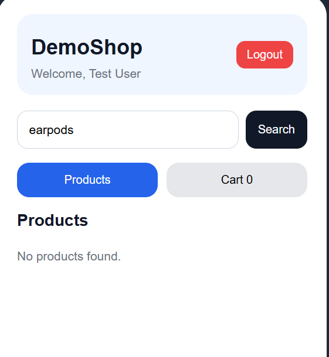
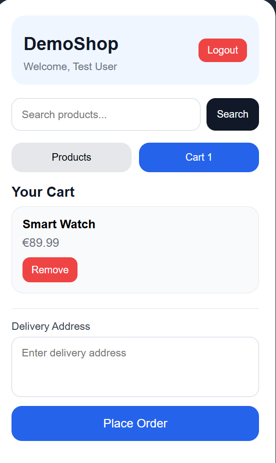
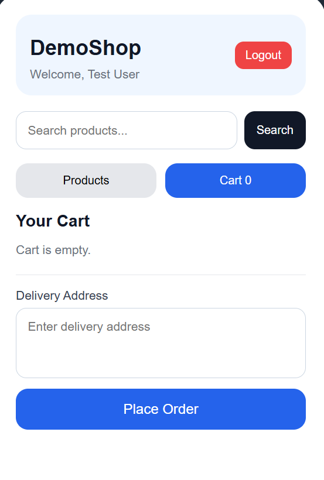
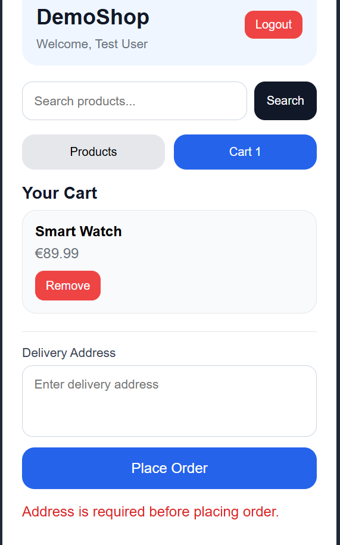
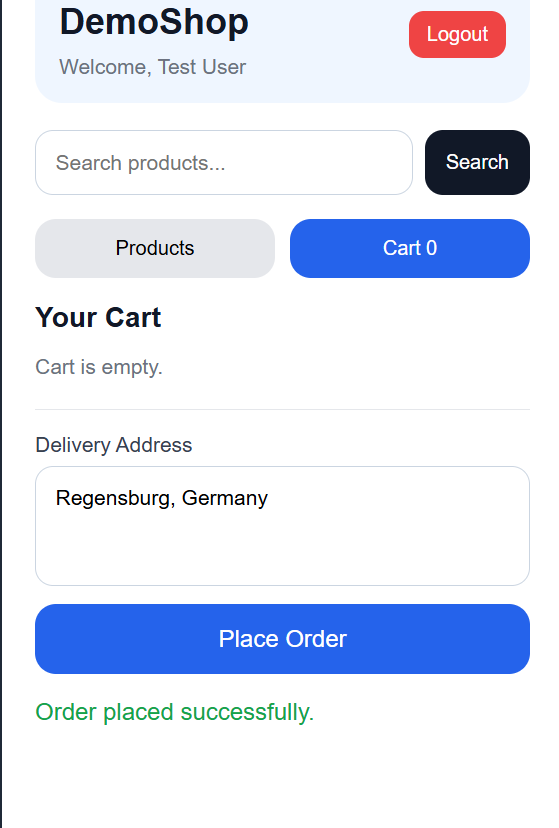

# DemoShop Mobile QA Testing Project

This project contains a working mock mobile shopping web app and complete QA testing documentation.

## Project Objective

The objective of this project is to demonstrate mobile app QA testing skills through a realistic mock application, functional test cases, bug report examples, reproduction steps, expected vs actual results, screenshots, and a structured test summary report.

## Application Features

- Valid login
- Invalid login validation
- Product search
- No result search validation
- Add to cart
- Remove from cart
- Checkout validation
- Order confirmation
- Logout functionality

## Test Login

| Field | Value |
|---|---|
| Username | testuser@example.com |
| Password | Test@123 |

## Tools Used

- HTML
- CSS
- JavaScript
- Manual Testing
- Functional Testing
- Mobile QA Testing
- Bug Reporting
- Test Summary Reporting
- GitHub Documentation

## Project Structure

```text
mobile-app-qa-test-plan-demo
│
├── index.html
├── style.css
├── script.js
├── README.md
│
├── docs
│   ├── test_plan.md
│   ├── test_cases.md
│   ├── bug_reports.md
│   └── test_summary_report.md
│
└── screenshots
    ├── login_screen.png
    ├── wrong_login.png
    ├── home_screen.png
    ├── product_not_found.png
    ├── cart_screen.png
    ├── remove_from_cart.png
    ├── checkout_validation.png
    └── order_success.png
```

## Application Screenshots

### Login Screen


### Wrong Login Validation


### Home / Product Screen


### Product Not Found


### Cart Screen


### Remove from Cart


### Checkout Validation


### Order Success


## QA Documentation

- Test Plan: `docs/test_plan.md`
- Test Cases: `docs/test_cases.md`
- Bug Report Examples: `docs/bug_reports.md`
- Test Summary Report: `docs/test_summary_report.md`

## How to Run

Open `index.html` in a browser.

For best experience, use browser responsive mode or mobile screen size.

## GitHub Pages

Live Demo: https://rohanr2906-byte.github.io/mobile-app-qa-test-plan-demo/

## Test Scope

The following workflows were tested manually:

- Login with valid credentials
- Login with invalid credentials
- Product search with valid keyword
- Product search with unavailable product
- Add product to cart
- Remove product from cart
- Checkout without address
- Checkout with valid address
- Logout functionality

## Project Outcome

This project demonstrates mobile QA testing fundamentals, including test planning, functional test case design, bug reporting, reproduction steps, expected vs actual result documentation, screenshot evidence, and test summary reporting using a working mock mobile web application.

## Future Improvements

- Add automated UI tests using Playwright
- Add responsive testing for different mobile screen sizes
- Add backend API integration
- Add test execution report in HTML format